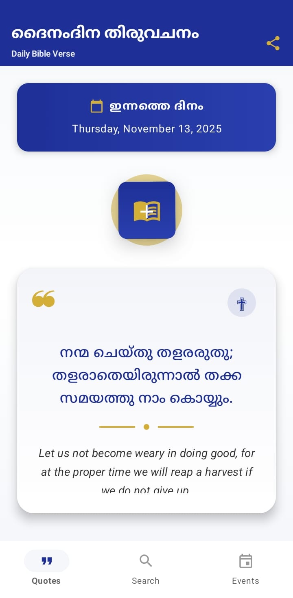
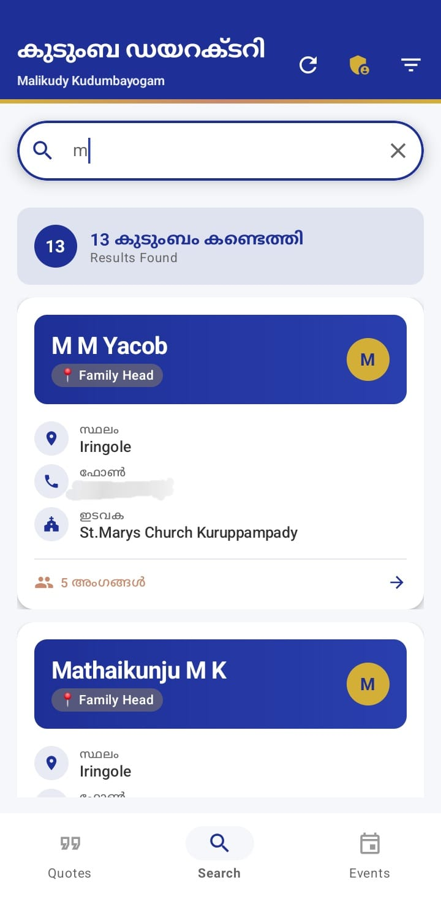
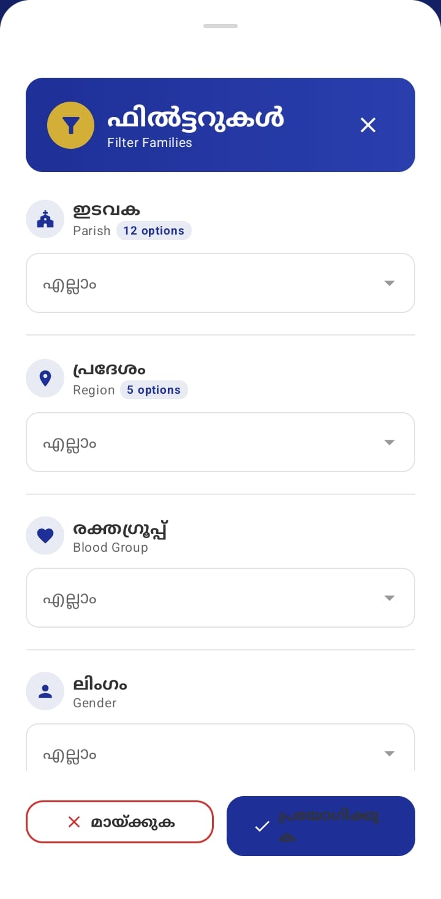
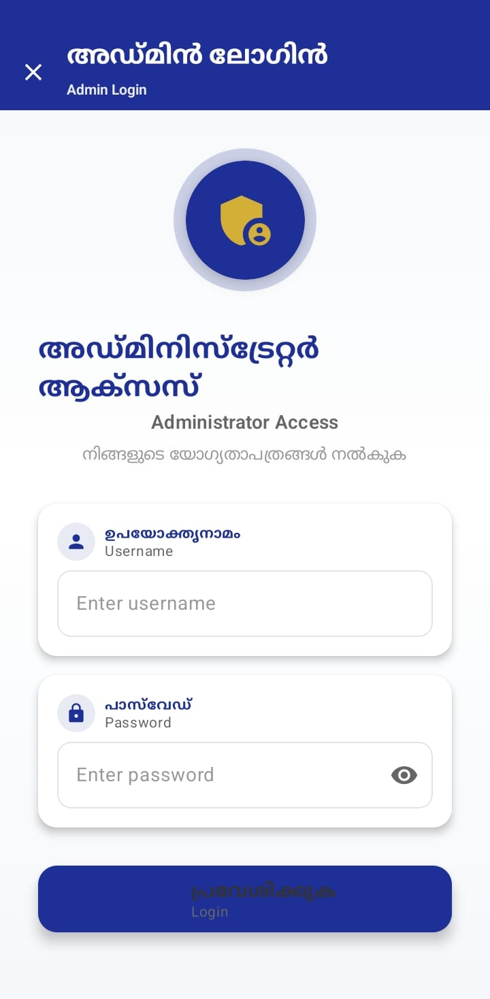
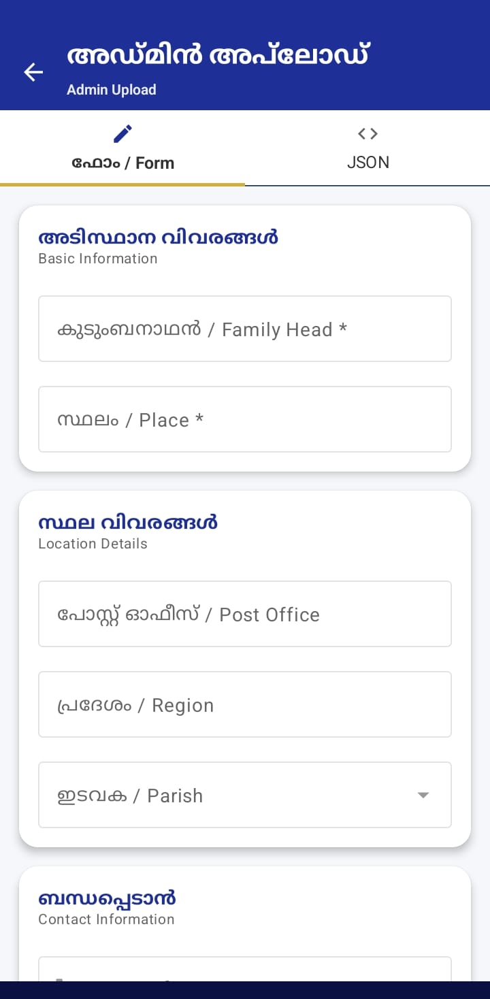

# 🏛️  Family Directory

<div align="center">


**A comprehensive digital family directory app for the Malikudy community, preserving family connections and heritage across Kerala and beyond.**

[Download APK](https://github.com/shanavasvb/familydirectory/releases) • [Report Bug](https://github.com/shanavasvb/familydirectory/issues) • [Request Feature](https://github.com/shanavasvb/familydirectory/issues)

</div>

---

## 📖 Table of Contents

- [About The Project](#-about-the-project)
- [Features](#-features)
- [Screenshots](#-screenshots)
- [Technology Stack](#️-technology-stack)
- [Architecture](#️-architecture)
- [Getting Started](#-getting-started)
- [Project Structure](#-project-structure)
- [Firebase Configuration](#-firebase-configuration)
- [Building the App](#-building-the-app)
- [Usage Guide](#-usage-guide)
- [Admin Features](#-admin-features)
- [Data Structure](#-data-structure)
- [Roadmap](#️-roadmap)
- [Contributing](#-contributing)
- [License](#-license)
- [Contact](#-contact)
- [Acknowledgments](#-acknowledgments)

---

## 🌟 About The Project

The **Malikudy Kudumbayogam Family Directory** is a modern Android application designed to digitally preserve and connect the Malikudy family community. Originally migrating from Wayanad to various parts of Kerala and beyond, this app serves as a comprehensive directory of family members, their locations, and relationships.

### 🎯 Purpose

- **Preserve Heritage**: Digitally document family lineage and connections
- **Community Connection**: Help family members find and connect with each other
- **Event Sharing**: Share family events, gatherings, and important announcements
- **Emergency Contacts**: Quick access to family members for urgent situations
- **Historical Record**: Maintain detailed records of family history and migrations

### 🌍 Community Reach

The app serves families across:
- **Kerala**: Ernakulam, Wayanad, Palakkad
- **Tamil Nadu**: Nilgiri District
- **International**: Kuwait, Saudi Arabia, UK, Canada, Qatar

---

## ✨ Features

### 🔍 Smart Search & Filter

- **Advanced Search**: Search by name, place, phone number, email, parish, region
- **Dynamic Filters**: Filter by:
  - 🏛️ Parish/Church (dynamically loaded from Firebase)
  - 📍 Region (Kumbleri, Nilgiri, Valiyaveedu, Elanthuruthy, മാത്താംപാട്ട)
  - 🩸 Blood Group (A+, A-, B+, B-, AB+, AB-, O+, O-)
  - 👥 Gender (Male/Female)
- **Real-time Results**: Instant search results with highlighted matches
- **Filter Combinations**: Apply multiple filters simultaneously
- **Case-Insensitive Matching**: Flexible search that handles variations in data

### 👨‍👩‍👧‍👦 Family Details

- **Complete Family Information**: Head of family and all members
- **Detailed Information**:
  - Name, Relation, Date of Birth
  - Education, Occupation, Institution
  - Contact: Phone, Email
  - Location: Place, Post Office, Parish, Region
  - Medical: Blood Group
  - Family Connections: Father, Mother, Spouse names
- **Family Member Cards**: Beautiful UI showing all family members
- **Spouse Details**: Track marriage connections between families

### 📸 Event Gallery

- **Community Events**: Upload and view family gatherings, celebrations
- **Photo Gallery**: Beautiful grid layout for event photos
- **Event Details**: Event name, description, date
- **Image Upload**: Admin can upload multiple photos per event
- **Cloud Storage**: Images hosted on Cloudinary for fast loading

### 🔐 Admin Panel

- **Secure Login**: Password-protected admin access
- **Data Management**:
  - ✅ Add new families
  - ✏️ Edit existing records
  - 🗑️ Remove outdated entries
- **Event Management**: Upload events with multiple photos
- **Dual Input Methods**:
  - 📝 Form-based entry (user-friendly)
  - 💻 JSON bulk upload (advanced)
- **Data Validation**: Ensures data integrity
- **Filter Refresh**: Manual refresh button to update dynamic filter options

### 🎨 Beautiful UI/UX

- **Material Design 3**: Modern, intuitive interface
- **Kerala Theme Colors**:
  - 🔵 Deep Royal Blue (primary)
  - 🟡 Heritage Gold (accent)
  - 🟠 Warm Terracotta (secondary)
- **Bilingual Support**: Malayalam and English throughout
- **Smooth Animations**: Polished transitions and interactions
- **Responsive Design**: Works on all screen sizes
- **Loading States**: Clear feedback during operations

### 🚀 Performance & Optimization

- **Fast Loading**: Optimized Firebase queries
- **Efficient Caching**: Smart data caching with Coil
- **Low Memory Usage**: Efficient image loading
- **Small APK Size**: Approximately 16MB
- **Background Sync**: Automatic data updates

---

## 📱 Screenshots  

<div align="center">

| 🏠 Splash / First Page | 💬 Daily Quotes | 🔍 Search | 🧩 Filters |
|:---:|:---:|:---:|:---:|
|  |  |  |  |

| 👨‍👩‍👧‍👦 Admin Panel | ➕ Add Family | 📸 Upload Event | ⚙️ Admin Form |
|:---:|:---:|:---:|:---:|
|  |  | 

</div>

---
## 🛠️ Technology Stack

### Frontend
-  - Primary programming language
-  - Modern UI toolkit
-  - Design system

### Backend & Database
-  - NoSQL cloud database
-  - Authentication

### Image Handling
-  - Image hosting & optimization
-  - Async image loading

### Architecture & Libraries
-  - Design pattern
-  - Async programming
-  - Reactive streams
-  - Screen navigation
-  - UI state management

### Development Tools
- 
- 
- 

---

## 🏗️ Architecture

The app follows **Clean Architecture** principles with **MVVM** pattern:

```
┌─────────────────────────────────────────────────────────┐
│                     Presentation Layer                   │
│  ┌───────────┐  ┌───────────┐  ┌───────────┐           │
│  │  Search   │  │  Details  │  │   Admin   │           │
│  │  Screen   │  │  Screen   │  │  Screen   │           │
│  └─────┬─────┘  └─────┬─────┘  └─────┬─────┘           │
│        │              │              │                   │
│  ┌─────▼──────────────▼──────────────▼─────┐           │
│  │           ViewModel Layer                 │           │
│  │  • SearchViewModel                        │           │
│  │  • FamilyDetailsViewModel                 │           │
│  │  • AdminUploadViewModel                   │           │
│  └─────────────────┬─────────────────────────┘           │
└────────────────────┼──────────────────────────────────────┘
                     │
┌────────────────────▼──────────────────────────────────────┐
│                   Domain Layer                             │
│  ┌─────────────────────────────────────────────┐          │
│  │         Use Cases (Business Logic)          │          │
│  │  • Search Families                          │          │
│  │  • Filter by Parish/Region                  │          │
│  │  • Add/Edit/Delete Family                   │          │
│  │  • Upload Events                            │          │
│  └─────────────────┬───────────────────────────┘          │
└────────────────────┼────────────────────────────────────────┘
                     │
┌────────────────────▼────────────────────────────────────────┐
│                    Data Layer                                │
│  ┌──────────────────┐     ┌──────────────────┐             │
│  │   Repository     │     │   Data Models    │             │
│  │  • FamilyRepo    │     │  • Family        │             │
│  │  • EventRepo     │     │  • FamilyMember  │             │
│  └────────┬─────────┘     │  • Event         │             │
│           │               │  • SearchFilters │             │
│  ┌────────▼─────────┐     └──────────────────┘             │
│  │   Data Sources   │                                       │
│  │  • Firebase      │                                       │
│  │  • Cloudinary    │                                       │
│  └──────────────────┘                                       │
└──────────────────────────────────────────────────────────────┘
```

### Key Design Patterns

- **MVVM**: Clear separation of UI and business logic
- **Repository Pattern**: Abstract data sources
- **Observer Pattern**: StateFlow for reactive UI
- **Single Source of Truth**: Firebase as authoritative data source

---

## 🚀 Getting Started

### Prerequisites

- **Android Studio**: Ladybug | 2024.2.1 or higher
- **JDK**: Version 11 or higher
- **Android SDK**: API 26 (Android 8.0) minimum
- **Git**: For version control
- **Firebase Account**: For backend services
- **Cloudinary Account**: For image hosting (optional)

### Installation

1. **Clone the repository**
   ```bash
   git clone https://github.com/shanavasvb/familydirectory.git
   cd familydirectory
   ```

2. **Open in Android Studio**
   ```
   File → Open → Select the 'familydirectory' folder
   ```

3. **Configure Firebase**
   - Go to [Firebase Console](https://console.firebase.google.com/)
   - Create a new project or use existing
   - Add Android app with package name: `com.example.familydirectory`
   - Download `google-services.json`
   - Place it in `app/` directory

4. **Configure Cloudinary (Optional)**
   
   Update in `AdminUploadViewModel.kt`:
   ```kotlin
   private val CLOUDINARY_CLOUD_NAME = "your_cloud_name"
   private val CLOUDINARY_UPLOAD_PRESET = "your_preset"
   ```

5. **Sync Gradle**
   ```
   File → Sync Project with Gradle Files
   ```

6. **Run the app**
   ```
   Run → Run 'app'
   ```
   or press `Shift + F10`

---

## 📂 Project Structure

```
familydirectory/
├── app/
│   ├── src/
│   │   ├── main/
│   │   │   ├── java/com/example/familydirectory/
│   │   │   │   ├── data/
│   │   │   │   │   ├── model/
│   │   │   │   │   │   ├── Family.kt
│   │   │   │   │   │   ├── FamilyMember.kt
│   │   │   │   │   │   ├── Event.kt
│   │   │   │   │   │   ├── SearchFilters.kt
│   │   │   │   │   │   ├── SearchResult.kt
│   │   │   │   │   │   └── FilterOptions.kt
│   │   │   │   │   └── repository/
│   │   │   │   │       ├── FamilyRepository.kt
│   │   │   │   │       └── EventRepository.kt
│   │   │   │   │
│   │   │   │   ├── ui/
│   │   │   │   │   ├── theme/
│   │   │   │   │   │   ├── Color.kt
│   │   │   │   │   │   ├── Theme.kt
│   │   │   │   │   │   └── Type.kt
│   │   │   │   │   │
│   │   │   │   │   ├── search/
│   │   │   │   │   │   ├── SearchScreen.kt
│   │   │   │   │   │   ├── SearchViewModel.kt
│   │   │   │   │   │   └── FilterBottomSheet.kt
│   │   │   │   │   │
│   │   │   │   │   ├── details/
│   │   │   │   │   │   ├── FamilyDetailsScreen.kt
│   │   │   │   │   │   └── FamilyDetailsViewModel.kt
│   │   │   │   │   │
│   │   │   │   │   ├── events/
│   │   │   │   │   │   ├── EventsScreen.kt
│   │   │   │   │   │   └── EventsViewModel.kt
│   │   │   │   │   │
│   │   │   │   │   ├── admin/
│   │   │   │   │   │   ├── AdminLoginScreen.kt
│   │   │   │   │   │   ├── AdminUploadScreen.kt
│   │   │   │   │   │   ├── AdminUploadViewModel.kt
│   │   │   │   │   │   ├── FormUploadContent.kt
│   │   │   │   │   │   └── JsonUploadContent.kt
│   │   │   │   │   │
│   │   │   │   │   └── upload/
│   │   │   │   │       ├── UploadEventScreen.kt
│   │   │   │   │       └── UploadEventViewModel.kt
│   │   │   │   │
│   │   │   │   ├── navigation/
│   │   │   │   │   └── NavGraph.kt
│   │   │   │   │
│   │   │   │   └── MainActivity.kt
│   │   │   │
│   │   │   ├── res/
│   │   │   │   ├── drawable/
│   │   │   │   ├── values/
│   │   │   │   │   ├── colors.xml
│   │   │   │   │   ├── strings.xml
│   │   │   │   │   └── themes.xml
│   │   │   │   └── mipmap/
│   │   │   │
│   │   │   └── AndroidManifest.xml
│   │   │
│   │   └── test/
│   │
│   ├── build.gradle.kts
│   ├── proguard-rules.pro
│   └── google-services.json (gitignored)
│
├── gradle/
│   ├── libs.versions.toml
│   └── wrapper/
│
├── build.gradle.kts
├── settings.gradle.kts
├── .gitignore
├── README.md
└── LICENSE
```

---

## 🔥 Firebase Configuration

### Firestore Database Structure

```javascript
families/
├── {familyId}/
│   ├── familyHead: String
│   ├── place: String
│   ├── postOffice: String
│   ├── region: String
│   ├── parish: String
│   ├── phone: String
│   ├── email: String
│   ├── job: String
│   ├── education: String
│   ├── bloodGroup: String
│   ├── dob: String
│   ├── gender: String
│   ├── fatherName: String
│   ├── motherName: String
│   ├── district: String
│   ├── otherInfo: String
│   ├── spouseDetails: Array<String>
│   ├── createdAt: Timestamp
│   └── familyMembers: Array<Object>
│       ├── name: String
│       ├── relation: String
│       ├── fatherName: String
│       ├── motherName: String
│       ├── spouseName: String
│       ├── dob: String
│       ├── education: String
│       ├── job: String
│       ├── institution: String
│       ├── phone: String
│       ├── email: String
│       ├── bloodGroup: String
│       └── gender: String

events/
├── {eventId}/
│   ├── title: String
│   ├── description: String
│   ├── imageUrls: Array<String>
│   ├── createdAt: Timestamp
│   └── createdBy: String
```

### Firestore Security Rules

```javascript
rules_version = '2';
service cloud.firestore {
  match /databases/{database}/documents {
    // Allow read access to all users
    match /families/{familyId} {
      allow read: if true;
      allow write: if request.auth != null;
    }
    
    match /events/{eventId} {
      allow read: if true;
      allow write: if request.auth != null;
    }
  }
}
```

### Firebase Authentication

Admin authentication uses Firebase Auth with password-based login. Admin credentials are configured securely.

---

## 🔨 Building the App

### Debug Build (For Testing)

```bash
# Clean previous builds
./gradlew clean

# Build debug APK
./gradlew assembleDebug

# Install on connected device
./gradlew installDebug

# APK location
app/build/outputs/apk/debug/app-debug.apk
```

### Release Build (For Distribution)

**Step 1: Generate Keystore (First time only)**

```bash
keytool -genkey -v \
  -keystore malikudy-release-key.jks \
  -keyalg RSA \
  -keysize 2048 \
  -validity 10000 \
  -alias malikudy
```

**Step 2: Configure Signing**

Create `keystore.properties` in project root:

```properties
storePassword=your_store_password
keyPassword=your_key_password
keyAlias=malikudy
storeFile=../malikudy-release-key.jks
```

**Step 3: Build Release APK**

```bash
# Build release APK
./gradlew assembleRelease

# APK location
app/build/outputs/apk/release/app-release.apk
```

---

## 📘 Usage Guide

### For Regular Users

#### 1. Search for Families

```
Open App → Search Bar → Type name/place/phone
```

- Real-time search results
- Highlighted matching terms
- Shows matched field (name, place, etc.)

#### 2. Apply Filters

```
Click Filter Icon → Select filters → Apply
```

**Available Filters:**
- **Parish**: Dynamically loaded from Firebase
- **Region**: 5 regions including Malayalam
- **Blood Group**: All 8 types
- **Gender**: Male/Female

#### 3. View Family Details

```
Search Results → Tap Family Card → View Full Details
```

Shows complete family information including all members and relationships.

#### 4. View Events

```
Bottom Navigation → Events → Browse Gallery
```

### For Administrators

#### 1. Admin Login

```
Search Screen → Admin Icon (Top Right) → Enter Password
```

#### 2. Add New Family

**Method A: Form Input**
```
Admin Panel → Add Family → Form Tab → Fill Details → Submit
```

**Method B: JSON Upload**
```
Admin Panel → Add Family → JSON Tab → Paste JSON → Upload
```

#### 3. Upload Events

```
Admin Panel → Upload Event
→ Enter Title & Description
→ Select Images
→ Upload
```

#### 4. Refresh Filter Options

```
Search Screen → Refresh Icon → Dynamic filters updated
```

---

## 🔐 Admin Features

### Admin Password

Set in `AdminLoginScreen.kt`. Consider using Firebase Remote Config for dynamic password management in production.

### Bulk Data Upload

JSON format for family data:

```json
{
  "familyHead": "John Mathew",
  "place": "Iringole",
  "postOffice": "Iringole",
  "region": "Valiyaveedu",
  "parish": "St. Mary's Orthodox Church, Kuruppampady",
  "phone": "9497547284",
  "email": "john@example.com",
  "job": "Teacher",
  "education": "M.A.",
  "bloodGroup": "B positive (B+)",
  "dob": "1975-05-15",
  "gender": "Male",
  "fatherName": "Mathew K",
  "motherName": "Mary M",
  "familyMembers": [
    {
      "name": "Sarah John",
      "relation": "Wife",
      "dob": "1978-08-20",
      "gender": "Female",
      "bloodGroup": "A positive (A+)"
    }
  ]
}
```

---

## 📊 Data Structure

### Family Model

```kotlin
data class Family(
    val id: String = "",
    val familyHead: String = "",
    val place: String = "",
    val postOffice: String = "",
    val region: String = "",
    val parish: String = "",
    val phone: String = "",
    val email: String = "",
    val job: String = "",
    val education: String = "",
    val bloodGroup: String = "",
    val dob: String = "",
    val gender: String = "",
    val fatherName: String = "",
    val motherName: String = "",
    val district: String = "",
    val otherInfo: String = "",
    val spouseDetails: List<String> = emptyList(),
    val familyMembers: List<FamilyMember> = emptyList(),
    val createdAt: Timestamp? = null
)
```

### Family Member Model

```kotlin
data class FamilyMember(
    val id: String = "",
    val name: String = "",
    val relation: String = "",
    val fatherName: String = "",
    val motherName: String = "",
    val spouseName: String = "",
    val dob: String = "",
    val education: String = "",
    val job: String = "",
    val institution: String = "",
    val phone: String = "",
    val email: String = "",
    val bloodGroup: String = "",
    val gender: String = ""
)
```

---

## 🗺️ Roadmap

### Version 1.1 (Planned)
- [ ] Family tree visualization
- [ ] Export family data to PDF
- [ ] Birthday notifications
- [ ] Advanced search with date ranges
- [ ] Multi-language support

### Version 1.2 (Planned)
- [ ] Family chat groups
- [ ] Event RSVP system
- [ ] Family photo albums
- [ ] Anniversary reminders
- [ ] Family news feed

### Version 2.0 (Future)
- [ ] Interactive family tree with zoom
- [ ] DNA/ancestry integration
- [ ] Historical document storage
- [ ] Video interviews archive
- [ ] Migration maps

---

## 🤝 Contributing

Contributions are what make the open-source community amazing! Any contributions you make are **greatly appreciated**.

### How to Contribute

1. **Fork the Project**
2. **Create Feature Branch** (`git checkout -b feature/AmazingFeature`)
3. **Commit Changes** (`git commit -m 'Add: Amazing new feature'`)
4. **Push to Branch** (`git push origin feature/AmazingFeature`)
5. **Open Pull Request**

### Contribution Guidelines

- ✅ Follow MVVM architecture
- ✅ Use Jetpack Compose for UI
- ✅ Write meaningful commit messages
- ✅ Add comments for complex logic
- ✅ Test on multiple devices
- ✅ Respect bilingual requirements (Malayalam + English)

---

## 📜 License

Distributed under the MIT License. See `LICENSE` for more information.

---

## 📞 Contact

**Developer**: Shanavasvb

- GitHub: [@shanavasvb](https://github.com/shanavasvb)
- Email: shanavasvbasheer@gmail.com
- Project Link: [https://github.com/shanavasvb/familydirectory](https://github.com/shanavasvb/familydirectory)

---

## 🙏 Acknowledgments

### Special Thanks

- **Malikudy Kudumbayogam Committee** - For vision and support
- **Family Elders** - For providing historical data and genealogy
- **Beta Testers** - For valuable feedback
- **Community Members** - For data contribution

### Technologies Used

- [Jetpack Compose](https://developer.android.com/jetpack/compose) - Modern Android UI
- [Firebase](https://firebase.google.com/) - Backend infrastructure
- [Cloudinary](https://cloudinary.com/) - Image management
- [Coil](https://coil-kt.github.io/coil/) - Image loading
- [Material Design 3](https://m3.material.io/) - Design system
- [Kotlin Coroutines](https://kotlinlang.org/docs/coroutines-overview.html) - Async operations

---

## 📈 Statistics


---

<div align="center">

### Made with ❤️ for the Malikudy Community

**If this project helps you, please consider giving it a 🌟

</div>
